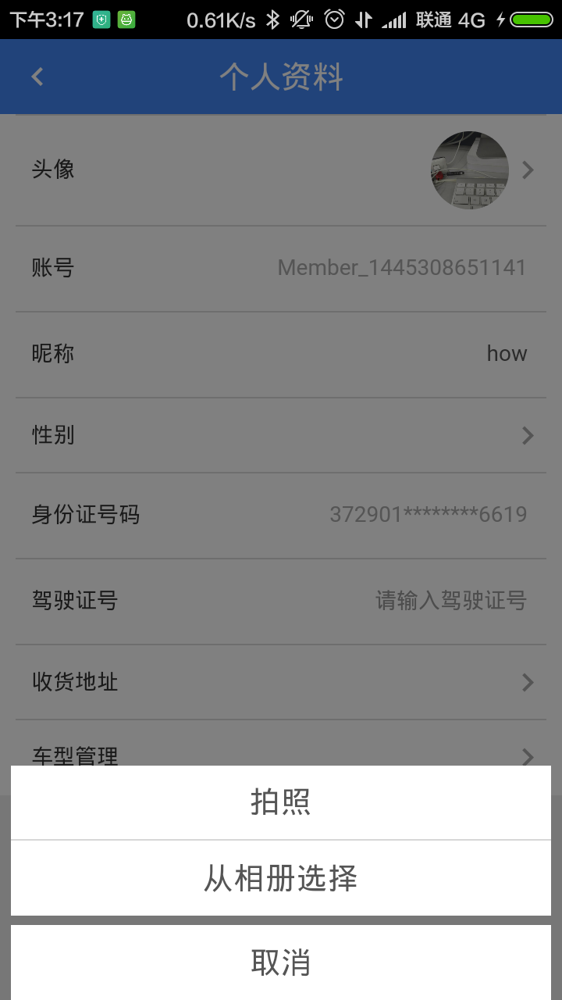
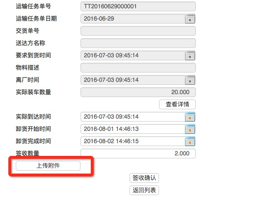
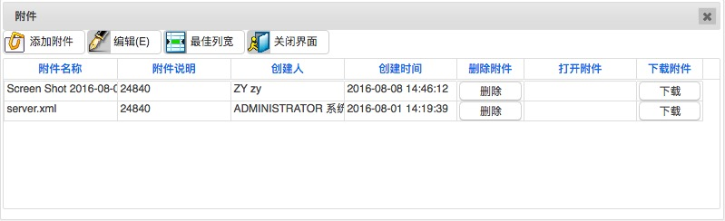

### ImageText控件

### 作用
- 上传附件
- 展示图片
- 拍照

### 样式
流程1             |  流程2             |  流程3
:-------------------------:|:-------------------------:|:-------------------------:
||

### Yigo如何配置

#### Yigo的上传控件一般是这样的

错误的上传组件1             |  错误的上传组件2
:-------------------------:|:-------------------------:
|

与Yigo的上传控件没有任何关系

与Yigo的上传控件没有任何关系

与Yigo的上传控件没有任何关系

### 页面如何配置

