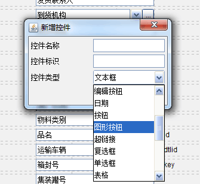
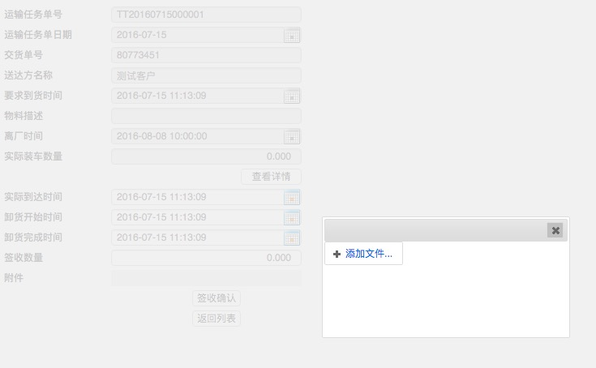
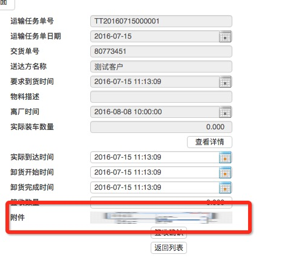

### ImageText控件

### 作用
- 上传附件
- 展示图片
- 拍照

### 样式
流程1             |  流程2             |  流程3
:-------------------------:|:-------------------------:|:-------------------------:
||

### Yigo如何配置

#### 错误的上传组件

错误的上传组件1             |  错误的上传组件2
:-------------------------:|:-------------------------:
|

#### 正确的组件是这样的:

正确的上传组件（YIGO设计器）             |  正确的上传组件（YIGO Web）1 |  正确的上传组件（YIGO Web）2
:-------------------------:|:-------------------------:|:-------------------------:
|||

**注意：这个“图形按钮”控件的值默认放在缓存里面，需要把控件的图片作为一个普通的字段进行处理，保存到数据库里。**


### 页面如何配置

```javascript
{
	yigoid:'attachment',
	xtype:'map_picture',
	label:'附件',
}
